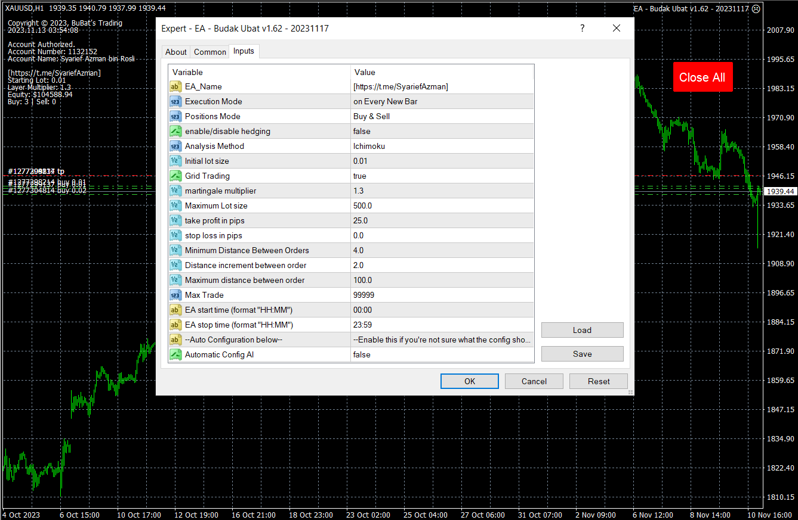
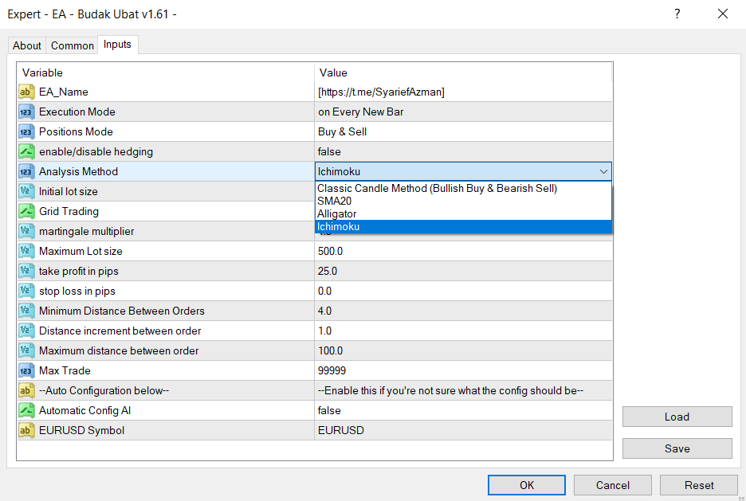

## Additional License Information

While this software is licensed under the MIT License, please note that it **may not be sold or used for commercial purposes**. This restriction is to ensure that the software remains free and that the author is not held liable for any commercial use.


# EA Budak Ubat - [Download](https://github.com/syarief02/EA_Budak_Ubat/raw/main/EA%20-%20Budak%20Ubat%20v1.62%20-%2020251130.ex4)

## Table of contents

- [Overview](#overview)
  - [How it works](#how-it-works)
  - [EA Parameters](#ea-parameters)
    - [Execution Mode](#execution-mode)
    - [Positions Mode](#positions-mode)
    - [Enable/Disable Hedging](#enabledisable-hedging)
    - [Analysis Method](#analysis-method)
    - [Initial lot size](#initial-lot-size)
    - [Grid Trading](#grid-trading)
    - [Martingale multiplier](#martingale-multiplier)
    - [Maximum Lot size](#maximum-lot-size)
    - [Take Profit & Stop Loss in pips](#take-profit--stop-loss-in-pips)
    - [Minimum/Maximum Distance Between Orders](#minimummaximum-distance-between-orders)
    - [Distance Increment Between Orders](#distance-increment-between-orders)
    - [Max Trade](#max-trade)
    - [Automatic Config AI](#automatic-config-ai)
- [Authorized account list](#authorized-account-list)
  - [How to get authorized](#how-to-get-authorized)
    - [CXM](#cxm)
    - [FBS](#fbs)
    - [HeadWay](#headway)
    - [forex4you](#forex4you)
    - [OctaFx](#octafx)
    - [InstaForex](#instaforex)
    - [LiteForex](#liteforex)
    - [RoboForex](#roboforex)
    - [XM](#xm)
    - [Valetax](#valetax)
- [How to install an EA on MT4 (fastest method)](#how-to-install-an-ea-on-mt4-fastest-method)
- [USING A VPS](#using-a-vps)
  - [Need VPS?](#need-vps)
- [Update Logs](#update-logs)
  - [EA Budak Ubat v1.62](#ea-budak-ubat-v162)
  - [EA Budak Ubat v1.61](#ea-budak-ubat-v161)
  - [EA Budak Ubat v1.60](#ea-budak-ubat-v160)
  - [EA Budak Ubat v1.58](#ea-budak-ubat-v158)
  - [EA Budak Ubat v1.56](#ea-budak-ubat-v156)
  - [EA Budak Ubat v1.55](#ea-budak-ubat-v155)
- [Author](#author)
- [Legal Notice](#this-service-is-not-provided-to-citizens-of-countries-whose-domestic-regulations-classify-this-investment-offer-or-this-product-as-prohibited)

## Overview

## EA Budak Ubat v1.62 - [Download](https://github.com/syarief02/EA_Budak_Ubat/raw/main/EA%20-%20Budak%20Ubat%20v1.62%20-%2020251130.ex4)

### [Purchase Full Version](https://tinyurl.com/eabubuy)

### [EA Budak Ubat Channel](https://www.mql5.com/en/channels/eabudakubat)

Limited Time Price!

The price will increase by 10 USD after every 10 purchases!

---

### How it works

- When the EA is active, it will analyze the chart based on the Execution Mode parameter.

- If there are no existing positions on the chart, the EA will enter a trade based on the parameter. If the trend is bullish, it will enter a buy trade and if it is bearish it will enter a sell trade. And it will also set a Stop loss order at a certain distance from the opened trade price if the stop loss variable is greater than 0. 0 means no stop loss.

- If there are existing positions on the chart and the last one is in loss, EA will check if the distance between the current market price and the order is at least the minimum distance set by the user, and then it will enter a trade based on the candle, lot size will be calculated using the martingale method, and will set a Stop loss order at a certain distance from the opened trade price if the stop loss variable is greater than 0.

- If Hedging is set to false, the EA will only enter trades in one direction at a time. If the first position is a buy trade, all subsequent martingale positions must also be buy trades. If the first position is a sell trade, all subsequent martingale positions must also be sell trades. If Hedging is set to true, the EA will enter trades in both directions.

- The EA will modify the take profit of all positions in the same direction to a single break-even point plus the take profit level set by the user.

#

### EA Parameters

##### *Execution Mode:*

- on Every New Bar: when the EA is active, it will analyze the chart on every new bar (candle). It enter trades only after new candle appear. it will still follow the distance setting for the new layer, but only enter trades after the candle closes.  
on Every Tick: the EA enter trades immediately when attached and also enter new layer immediately when the distance between order setting is met.

##### *Positions Mode:*

- by default the EA uses the Buy & Sell mode, but it can be configured to operate only on Buy or in Sell.

##### *Enable/Disable Hedging:*

- If Hedging is set to false, the EA will only enter trades in one direction at a time. If the first position is a buy trade, all subsequent martingale positions must also be buy trades. If the first position is a sell trade, all subsequent martingale positions must also be sell trades.
- If Hedging is set to true, the EA will enter trades in both directions.

##### *Analysis Method:*

- This Parameter is only for the EA to determine the FIRST DIRECTION of the entry if there are no existing positions on the chart. It can be set to uses one of the four other analysis methods: Classic Candle (Bull/Bear), SMA20, Alligator, Ichimoku.

  - The older version of this EA was based on the Candle Method. If the candle is bullish, it will enter a buy trade and if it is bearish it will enter a sell trade.

  - The SMA20 is just a simple moving average of period 20. it buy above the line and sell below the line.

  - With Alligator it uses the Alligator indicator and it buy above all the 3 lines and sell below all the 3 lines.
    - The Williams Alligator indicator is a technical analysis tool that uses smoothed moving averages. The indicator uses a smoothed average calculated with a simple moving average (SMA) to start. It uses three moving averages, set at five, eight, and 13 periods. The three moving averages comprise the Jaw, Teeth, and Lips of the Alligator. The indicator applies convergence-divergence relationships to build trading signals, with the Jaw making the slowest turns and the Lips making the fastest turns.
      - Ref: <https://www.investopedia.com/articles/trading/072115/exploring-williams-alligator-indicator.asp> .

  - With Ichimoku, it uses the Ichimoku indicator. It buy above the cloud and sells below it.
    - The Ichimoku Cloud is a collection of technical indicators that show support and resistance levels, as well as momentum and trend direction. It does this by taking multiple averages and plotting them on a chart. It also uses these figures to compute a “cloud” that attempts to forecast where the price may find support or resistance in the future.
    - The Ichimoku Cloud is composed of five lines or calculations, two of which comprise a cloud where the difference between the two lines is shaded in.
    - The lines include a nine-period average, a 26-period average, an average of those two averages, a 52-period average, and a lagging closing price line.
    - The cloud is a key part of the indicator. When the price is below the cloud, the trend is down. When the price is above the cloud, the trend is up.
    - The above trend signals are strengthened if the cloud is moving in the same direction as the price. For example, during an uptrend, the top of the cloud is moving up, or during a downtrend, the bottom of the cloud is moving down.
      - Ref: <https://www.investopedia.com/terms/i/ichimoku-cloud.asp>

##### *Initial lot size:*

- the size of the first order. If the Martingale multiplier is greater than 1, this value will be increased using the value of the Martingale Multiplier. If the Martingale Multiplier is set to 1, the Initial lot size will also be used as size for the following orders.

##### *Grid Trading:*

- you can switch on/off Grid Trading True or False. if this function is turned off, the EA will transform into a single entry EA.

##### *Martingale multiplier:*

- it defines the multiplier used by the EA to increment the lot size of the orders after the first one. Set it to 1 disable the increment and the EA uses only the Initial Lot Size value

##### *Maximum Lot size:*

- when martingale lots has exceeded the Max Trade value, it will enter the Max Lot size value instead. This is just a simple solution to the uncontrollable martingale lot sizes.

##### *Take Profit & Stop Loss in pips:*

- these two values specify the amount of pips the EA uses to calculate the Take Profit and the Stop Loss (if configured)

##### *Minimum/Maximum Distance Between Orders:*

- these two value define the distance between orders, from a minimum value to a maximum. If you see the Max Distance to 10 pips, it will stop increment at 10 pips current distance.

##### *Distance Increment Between Orders:*

- this will increase the distance between order settings for the 3rd layer, 4th layer and so on.

##### *Max Trade:*

- this value tells the EA what is the maximum number of orders it can open in one direction.

##### *Automatic Config AI:*

- this is an AI. It will automatically adjust the best configuration for any pairs you are using. Turn this on and see the magic.

- ##### Autoconfig AI - Intelligent Trading Parameter Optimization

    "Autoconfig AI system" is a highly advanced tool in the world of trading that enables dynamic calculation of crucial parameters. While it may not be full artificial intelligence, it is an invaluable asset in the trading process.

    Here is a more detailed explanation of how it operates:

    1. Dynamic Parameter Calculation: Autoconfig AI has the capability to calculate essential parameters like Take Profit (TP) and Pip Step dynamically. It achieves this by taking the average of the highest and lowest prices over a 365-day period on a daily timeframe and adding this value by dividing it by 365. This approach results in parameter values that are constantly updated every day, as it always incorporates fresh data, regardless of the last day's price data.
    2. Real-Time Data Alignment: The tool continuously aligns with current market data, taking the highest and lowest prices on the current day and the previous day in its calculations.
    3. Average Daily Range (ADR): Beyond just calculating the daily range, Autoconfig AI consistently computes the Average Daily Range (ADR) for the current chart and all available currency pairs.
    4. Comparison Analysis: After the data collection phase, Autoconfig AI conducts comparison analysis of the average ranges among all currency pairs. This comparative analysis enables it to determine the optimal values for TP and Pip Step for each currency pair every minute.
    5. Continuous Updates: This tool is not static; instead, Autoconfig AI ensures that parameter values are continuously updated every minute, ensuring it remains in sync with rapidly changing market conditions.
    6. Automatic Configuration: Utilizing the collected data, Autoconfig AI seamlessly configures Take Profit, Pip Step, and additional distance parameters in your trading Expert Advisor (EA).
    In summary, "Autoconfig AI System" is an invaluable tool that leverages data and dynamic calculations to consistently align trading parameters, ensuring its usability and effectiveness in the context of the current market. This automated approach not only strengthens trading strategies but also ensures smooth adaptation to the ever-changing dynamics of financial markets.

---

### Authorized account list

please use CTRL+F shortcut to search for your account number.
>   30935753, 30935750, 30935749, 231105999, 231106000, 301423050, 231108522, 231107366, 437101, 231105601, 301429546, 301428462, 1253026, 45479042, 301425970, 4866577, 35066358, 20733294, 24265271, 24308938, 423655, 241272305, 30844787, 30844786, 271762633, 271762687, 271761548, 13042631, 271761625, 31031383, 241836624, 40209703, 428531, 301424257, 301420622, 30821619, 301420423, 260814087, 330018160, 13041727, 13041720, 260812069, 15127688, 260810419, 260810318, 260809709, 220763384, 260807856, 41474935, 110371577, 220760466, 220763383, 42673033, 220764630, 241797440, 40204188, 241779765, 220760133, 220757834, 110349588, 51379350, 220757761, 10589171, 220757426, 241764167, 220756561, 220756639, 301419237, 16581411, 231104393, 220754569, 290921520, 220754551, 220754458, 220754351, 110030128, 220753629, 220753544, 3805175, 231104416, 231101347, 231103989, 231103990, 260802695, 220747326, 231102420, 231100797, 231101152, 46138418, 290894056, 231099736, 290891017, 290891018, 231098986, 231097084, 231098630, 31018538, 536221, 301419571, 301419462, 301419236, 220476053, 13301739, 301419002, 301418623, 31018009, 271757912, 301417622, 1235226, 41328586, 301415814, 13300444, 38039998, 91931537, 1235225, 301415091, 301414688, 49156221, 15120370, 4574565, 407676, 271758951, 271758209, 41029112, 230325793, 271757233, 271756669, 49154578, 4573169, 260801772, 260800857, 40855756, 40818759, 30472764, 4572375, 260799123, 4120301, 22779978, 20966306, 260796883, 4571803, 260796867, 20981220, 5670568, 56171660, 241743374, 241743130, 24493784, 280788856, 44625475, 301410426, 38027769, 91922301, 4569257, 301408129, 301407379, 280790191, 384721, 301407291, 14253088, 301406548, 381957, 241738068, 15116397, 10259378, 374657, 33164480, 271750884, 31009450, 13039831, 75040932, 38023755, 13038587, 38278508, 45470568, 45471082, 90529337, 378600, 231094469, 13037390, 110447778, 231093230, 231093215, 280768223, 40172447, 3779695, 368622, 231092130, 231091871, 231091541, 231090788, 271405414, 13035331, 5075800, 271747529, 271747624, 271747617, 271747922, 128629018, 271747823, 13034491, 271747340, 40103100, 271746810, 24172371, 1228497, 67023650, 271746403, 241694961, 271745914, 271745778, 271745657, 271745025, 301406367, 5814938, 4618919, 359136, 301405259, 251005201, 301404899, 301404787, 230878495, 40005610, 50928949, 251023611, 310589109, 251011686, 56136701, 250738053, 50926643, 50926990, 6020467, 301402076, 301401831, 301401552, 241673648, 241673652, 260793536, 260793354, 260793151, 260793137, 330261658, 260792844, 310414845, 10582534, 25196877, 24281643, 260792334, 241637147, 260791720, 47105460, 75024017, 25182784, 25180557, 25182018, 43187065, 38008250, 349409, 10581650, 290827504, 10581156, 10581157, 46114152, 2100202361, 320325985, 250776195, 230878487, 10580112, 220677181, 212528, 301383073, 25134823, 110367864, 38007561, 320336495, 320341625, 10578632, 342856, 290788014, 25124937, 50911541, 320325985, 11758925, 24366538, 10577296, 271713150, 271714435, 310433979, 271710987, 241288762, 5879494, 10576950, 5879178, 1210812, 271708317, 1210655, 271706164, 4554051, 141006588, 47095826, 4566698, 6007330, 310433370, 310432147, 310427789, 4566517, 310428731, 6007088, 310428380, 467378, 467379, 260788186, 5874167, 4566325, 310416709, 310420287, 9785154, 310417582, 310412921, 310414039, 310413555, 1600109727, 310411959, 310411239, 6005601, 260789913, 230944394, 320125264, 5864001, 260784697, 260782092, 141000344, 56129966, 56129967, 38005357, 56129965, 22595771, 330246906, 17751851, 24372660, 110019895, 53483829, 2132602615, 102865, 260772890, 38216624, 56128453, 330259968, 330261080, 6973836, 250855267, 56119492, 24440346, 20932039, 330253189, 330252350, 437814, 6002511, 330247349, 22013702, 46102642, 56126565, 120201094, 51407995, 231088399, 231080470, 231080474, 38003230, 2100200249, 192139837, 231074929, 339376, 339176, 231067931, 320321354, 231065509, 220748121, 24368645, 24368642, 24368628, 24368617, 141136159, 192080160, 192080166, 192087997, 192080154, 290729490, 220734699, 6748098, 290768531, 301326664, 301326668, 310359156, 301329698, 750729, 13027894, 13527690, 301329704, 301329710, 10576779, 56120025, 310402183, 320323525, 301329718, 320287929, 320287926, 300724432, 301329724, 38000971, 320305818, 320287928, 320287930, 290797780, 320293256, 999049102, 189402, 187461, 1000012579, 192079962, 46002444, 47074913, 301329729, 5015555, 10574113, 10574122, 2100199368, 2100102903, 301370702, 301364931, 301364963, 301363842, 22668478, 117043700, 271619370, 271619248, 271619247, 271619242, 169745, 301342826, 5103852, 10572601, 301338471, 301340934, 2100127831, 301338667, 301338700, 301338711, 60127544, 241334311, 301333295, 21327810, 62630015, 290811032, 290811144, 35124407, 226727, 271376212, 271589085, 290793203, 290803005, 290803011, 290803023, 290803031, 290803035, 290803042, 290803045, 290777186, 290777238, 5793561, 290797783, 280428807, 290708505, 290708508, 10565339, 22642646, 60124625, 290793095, 290776570, 290778420, 290791966, 290791971, 290791974, 290791975, 290791976, 290791978, 290791980, 290791982, 290790446, 60127270, 290783307, 50893152, 60127243, 9106202, 4561741, 766118, 290779891, 290777138, 4561464, 24333650, 271705126, 271702365, 271702356, 271701961, 271701959, 271701950, 271700614, 271700604, 271700600, 271698838, 58808192, 22620250, 22619162, 60126730, 271680740, 65209315, 60126358, 53409128, 2875737, 5711440, 5711469, 15769428, 112883, 271670101, 271663568, 250972252, 250979131, 4559342, 3754760, 3754799, 60126208, 250966681, 250973804, 250966081, 800837865, 271628286, 260657559, 56105041, 250959657, 250957659, 35055890, 2100198278, 2100198280, 2100197940, 250953184, 250951695, 250950477, 250949189, 56104289, 363317, 250937747, 2100198277, 330231524, 1149678, 5767394, 5618549, 60125487, 117017757, 220579967, 60124536, 13025770, 330226965, 60124742, 2100197910, 13025412, 5000445, 5763809, 60124966, 60124932, 5763058, 330215114, 330215118, 330215126, 5762992, 330213208, 13024948, 330212436, 60124502, 362926, 548188, 13024780, 290448830, 320247513, 5670568, 60124670, 280755909, 21454957, 53379729, 13024449, 13022238, 60124033, 5527955, 5527967, 5586556, 5586494, 5586473, 5586460, 5585377, 60124032, 108151, 280742519, 280742542, 3751953, 280734909, 1148217, 5753815, 571958, 571729, 260753046, 260756315, 280730787, 280730796, 5585003, 13022980, 320207539, 46175797, 260764032, 260762646, 260758710, 310307023, 3957871, 5743926, 5434951, 241612110, 241612108, 27362937, 241612106, 241612105, 241612104, 241612103, 241612102, 241612100, 241612096, 241604510, 5742489, 241605261, 241617296, 443354, 22546495, 13021463, 13004694, 241591851, 290748564, 800833896, 241606464, 241605554, 231047192, 290589021, 241599814, 241599469, 13020888, 90307343, 90876405, 241598720, 241598716, 241598721, 241598555, 241598558, 241598559, 241596128, 231052121, 230942650, 241587481, 241587697, 241586738, 44094296, 5522658, 686468, 35050856, 330023862, 5724392, 220093895, 24110069, 47055958, 24390748, 220683034, 20890279, 231041409, 220670829, 231040169, 5711441, 290505538, 51194337, 310200794, 231038313, 55006805, 231037934, 8963723, 88014706, 4457412, 6336708, 360439, 20314776, 890367718, 8002244, 5727022, 5727021, 5727019, 5727018, 5727017, 5724676, 5724673, 5724670, 5713913, 5713912, 53338904, 231036521, 10569792, 10569822, 10569823, 10569824, 10569825, 260675215, 3748617, 330032453, 220708708, 10570144, 10570145, 10570146, 10570181, 220680918, 220694255, 220703637, 10570143, 10569437, 46071377, 220698139, 290636244, 220696924, 310364137, 310364161, 320243283, 310367068, 220695974, 220694810, 220694807, 220692136, 220692127, 10569667, 46070806, 220691140, 250852939, 438088, 220689347, 20829806, 220689025, 220689151, 241501008, 271557181, 250280548, 437834, 10568483, 90865412, 320183680, 21398598, 229488, 46069257, 220680804, 220678889, 310390721, 220677774, 320258092, 10568801, 320236039, 5611439, 310360242, 310393621, 330179201, 330019766, 310390036, 52133589, 310387193, 310382563, 310381317, 310362509, 310380447, 22224590, 5714333, 4558630, 5713692, 435807, 4558456, 310373184, 320239407, 320206708, 320206716, 320206723, 320206732, 4558004, 310371777, 260600979, 5711107, 310364286, 33126040, 90866470, 5434953, 301318199, 310361207, 310360465, 435036, 310360389, 320259320, 4557465, 789012, 345678

---

### **HOW TO GET AUTHORIZED::**

I lock the EA by account number for my client who is registered under my broker link only.  recommended account cent, laverage max.  minimum 100usd.

#### CXM

<https://secure.cxmdirect.com/links/go/5062>

Partner ID: 5062

#### FBS

<https://fbs.partners?ibl=1869&ibk=BuBat>

Partner id: 588292.

Support: <support@fbs.com>

#### HeadWay

<https://headway.partners/user/signup?hwp=516d6b>

Partner ID: 1021290

Support: <care@hw.site>

#### forex4you

<https://account.forex4you.com/en/user-registration/?affid=4hcnvz4>.

Partner code: 4hcnvz4

#### OctaFx

Link: <https://my.octafxmy.net/change-partner-request/?partner=246630>

Referral ID: 246630

Support: <support@octafx.com>

#### InstaForex

Link: <https://www.instaforex.com?x=KUSD>

Affiliate code: KUSD

Support: <support@instaforex.com>

#### LiteForex

<https://www.litefinance.com/?uid=805161060>

Partner UID: 805161060

Support: <clients@litefinance.com>

#### RoboForex

<https://my.roboforex.com/en/?a=mxyg>

Affiliate code: mxyg

Support: <info@roboforex.com>

#### XM

<https://clicks.pipaffiliates.com/c?c=862266&l=en&p=1>

Affiliate ID : A1202120

Partner Code: HVVR7

Support : <a href="https://clicks.pipaffiliates.com/c?c=862266&l=en&p=18">XM Support</a>

#### Valetax

<https://ma.valetax.com/partner/IB1939088>

Referral Code: IB1939088

Please select a broker that you have never registered.  tell me the trading account number after registering.  I will share the EA update file, and for fbs and forex4you clients you will get spread rebate of 50% of the commission that I get based on your total trade lot once a week.  Clients who have registered through my link can just PM the trading account number to me <https://t.me/SyariefAzman>.

---

### HOW TO INSTALL AN EA ON MT4 (fastest method)

[](https://youtu.be/leH9PGkLc6Q)

---

### USING A VPS

VPS (Virtual Private Server) in forex trading is a hosting service used by traders to run their trading platforms 24/7 without relying on their personal computers. It has many uses and benefits in forex trading, especially for those who have never used it before.

Here's an explanation of VPS in forex trading, its uses, and how to use it for those who have never used it before:

1. What is VPS in Forex Trading?

VPS is a virtual server that can be accessed remotely and functions like a physical computer. It runs 24/7 and is connected to the internet at high speed. Forex traders can install their trading platforms on this VPS and run them without keeping their personal computers active all the time. VPS provides stability and consistent connectivity, which is crucial in forex trading.

2. Uses of VPS in Forex Trading:

- Stability: VPS provides a stable trading environment as it is not affected by disruptions such as power outages, internet outages, or hardware issues that may occur with personal computers.

- 24/7 Connectivity: VPS is always connected to the internet, allowing traders to execute their trading strategies without constantly monitoring the market.

- Low Latency: VPS is often located in data centers with super-fast internet connections, reducing latency or delays in trade execution.

- Security: With VPS, a trader's data and trading platform are more secure because they are in an isolated environment.

3. How to Use VPS for Forex Trading:

- Choose a VPS Service: Traders should sign up for VPS services from a reliable hosting provider. Many forex brokers offer VPS for free or at an additional cost to their clients.

- Install the Trading Platform: Once you have access to VPS, install your favorite trading platform on the VPS. This can be done through remote access.

- Connect to VPS: Use remote desktop software like RDP (Remote Desktop Protocol) or SSH (Secure Shell) to connect to the VPS from your personal computer.

- Set Up and Run Trading Strategies: After connecting to VPS, traders can set up and run their trading strategies and monitor positions and market developments in real-time through remote desktop.

Using VPS in forex trading offers great flexibility and stability, especially for traders who want to run automated trading strategies or cannot always monitor the market directly. However, it's important to remember that choosing a reliable VPS provider and proper configuration are essential to ensure optimal performance in forex trading.

---

#### Need VPS?

🔥🚀 DON'T MISS OUT! LIMITED TIME OFFER! LIFETIME DISCOUNT for Forex VPS in New York, Amsterdam, London, and Malaysia!

To our valued customers,

Here's the exciting news you've been waiting for! We are delighted to announce an incredible 50% discount on Forex VPS packages, and this offer is not limited to just one or two locations, but includes Malaysia as well! But what's even more enticing is that, as a special bonus, you will enjoy this discount for a lifetime, with no set expiration period!

Grab this limited-time offer while stocks last! This opportunity is only available for a short time! Don't miss out on this chance, sign up now before it's too late. Take quick action to secure your spot! 🚀

📅 This promotion starts on September 22, 2023.

To avail of this exclusive discount, all you need to do is redeem the provided code and click on the link below to proceed with your order:

⏩ GBVPSFX50 - FX1 from RM79/month to RM39.50/month

❗️ Act fast! Limited to the first 100 new customers only.❗️

❗️Please note that this offer is not valid for customers looking to renew their subscriptions.❗️

🌐 Get it here: <https://tinyurl.com/GBVPSFX1>
PROMO CODE: GBVPSFX50

Thank you for choosing Forex VPS with GB Network. We are ready to serve you with enthusiasm!

[](https://tinyurl.com/GBVPSFX1)

***

### **UPDATE LOGS::**

#### EA Budak Ubat v1.62

```
What's new:-
In this latest version of EA Budak Ubat, we've introduced several new features and improvements to enhance your trading experience and provide more control over your trading activities. Here's what's new in version 1.62:

1. Close All Buttons: We've added a new feature that allows you to close all open positions with a single click. This provides a quick and easy way to manage your trades, especially in fast-moving market conditions.

2. Time Start and Time Stop: You now have the ability to set a specific start and stop time for the EA to run. This allows you to control when the EA is active, so you can align its operation with specific market hours or trading sessions.

3. Bug Fixes on Symbol Select: We've fixed some bugs related to symbol selection. The EA now correctly adds the selected symbol to the Market Watch window if it's not already there, ensuring smooth and error-free operation.

We hope these new features and improvements will enhance your trading experience with EA Budak Ubat. As always, we welcome your feedback and suggestions for future updates.
```



#### EA Budak Ubat v1.61

```
What's new:-

Analysis Method: the FIRST position will follow this analysis method.

Grid Trading: you can switch on/off Grid Trading True or False. if this function is turned off, the EA will transform into a single entry EA.

AutoConfig: this is an AI. It will automatically adjust the best configuration for any pairs you are using. Turn this on and see the magic.
```


***

#### EA Budak Ubat v1.60

```
what's new:-

Position Mode :- 
you can set it up to buy only or sell only mode

buy only -  the ea will only buy
sell only - the ea will only sell
buy and sell - the ea will buy and sell.

if hedging is false while in the buy and sell mode, it will enter only one way but it will decide whether to buy or sell based on the first candle close. if it is bullish it will buy, if it bearish it will sell. whichever comes first.

Maximum Lot :- 
when martingale lots has exceeded the Max Lot value, it will enter the Max Lot value instead.this is just a simple solution to the uncontrollable martingale lot sizes.
```

***

#### EA Budak Ubat v1.58

```
what's new: 
 
Execution Mode:- 
 
on Every Tick - the EA enter trades immediately when attached and also enter new layer immediately when the distance between order setting is met. 
 
on New Bar - this is the classic EA Budak Ubat entry style. it enter trades only after new candle appear. it will still follow the distance setting for the new layer. but only enter trades after the candle closed. 
 
Distance Increment:- 
 
this will increase the distance between order settings for the 3rd layer, 4th layer and so on. 
 
Max Distance:- 
 
this is the max distance between order. if you set it to 10 pip, it will stop increment at 10 pips current distance. 
  
- bug fixes on new bar function 
- MaxTrade is now separated for buy and sell in hedging true
```

***

#### EA Budak Ubat v1.56

```
This are just update on bug fixes and added Max Trade parameter.

account that already registered can use this file and it will be no expiry. only contact me to get the update if the expiry Alert pop up.
```

***

#### EA Budak Ubat v1.55

 ```
Here is the summary of how this EA works: 
 
 • When the EA is active, it will analyze the chart on every new bar 
 • If there are no existing positions on the chart, the EA will enter a trade based on the candle. If the candle is bullish, it will enter a buy trade and if it is bearish it will enter a sell trade. And it will also set a Stop loss order at a certain distance from the opened trade price if the stop loss variable is greater than 0. 0 means no stop loss. 
 • If there are existing positions on the chart and the last one is in loss, EA will check if the distance between the current market price and the order is at least the minimum distance set by the user, and then it will enter a trade based on the candle, lot size will be calculated using the martingale method, and will set a Stop loss order at a certain distance from the opened trade price if the stop loss variable is greater than 0. 
 • If Hedging is set to false, the EA will only enter trades in one direction at a time. If the first position is a buy trade, all subsequent martingale positions must also be buy trades. If the first position is a sell trade, all subsequent martingale positions must also be sell trades. If Hedging is set to true, the EA will enter trades in both directions. 
 • The EA will modify the take profit of all positions in the same direction to a single break-even point plus the take profit level set by the user. 
 • The EA will stop working and will display an alert message if the EA has expired. 
```

***

## Author

- Github - [Syarief Azman](https://github.com/syarief02)
- Telegram - [@SyariefAzman](https://t.me/SyariefAzman)
- Twitter - [@SyariefAzman](https://www.twitter.com/SyariefAzman)

# THIS SERVICE IS NOT PROVIDED TO CITIZENS OF COUNTRIES WHOSE DOMESTIC REGULATIONS CLASSIFY THIS INVESTMENT OFFER OR THIS PRODUCT AS PROHIBITED

**Risk warning:** Products traded on margin carry a high level of risk, and it is possible to lose all your capital. These products may not be suitable for everyone and you should ensure that you understand the risks involved.

**Restricted jurisdictions:** *EA Budak Ubat* does not offer its services to residents of the United States of America, Malaysia, the European Union, the United Kingdom, North Korea, Myanmar, Iran, or any other country whose domestic regulations classify such investment offerings as prohibited.

**Local law compliance:** *EA Budak Ubat* does not direct its website, software, or services to any person in any country in which the use of its website or services is prohibited by local legislation. When accessing or using this website or software from a country in which its use may be restricted, it is the user’s responsibility to ensure that any use of the website or services adheres to local legislation.

**No universal suitability:** *EA Budak Ubat* does not affirm that the information on its website or in its materials is suitable to all jurisdictions, or that the services are available in all jurisdictions.

---

## Additional Disclaimers

- **No investment advice:** Nothing in our materials, website, or software constitutes investment, financial, legal, or tax advice. Decisions you make using *EA Budak Ubat* are your own and at your own risk.
- **Past performance:** Historical results, forward-tests, and back-tests are not indicative of future performance. Market conditions can change rapidly.
- **Automation risks:** Automated trading involves technology risks including but not limited to connectivity, latency, VPS/broker outages, slippage, spread widening, and execution errors. You are responsible for monitoring your account and maintaining appropriate risk controls (e.g., position sizing, stop loss).
- **Broker independence:** *EA Budak Ubat* is independent and not affiliated with, endorsed by, or responsible for the actions of any broker or liquidity provider.
- **User responsibility:** You are solely responsible for complying with all applicable laws and regulations in your jurisdiction, and for ensuring the EA is permitted for use on your trading account.
- **Licensing & usage:** Unauthorized copying, resale, or distribution of *EA Budak Ubat* is prohibited. Access may be revoked for violations of the license terms.

---

*This disclaimer is provided for general information only and does not replace professional legal advice. If you are unsure whether you may use *EA Budak Ubat* in your country, consult your legal advisor.*